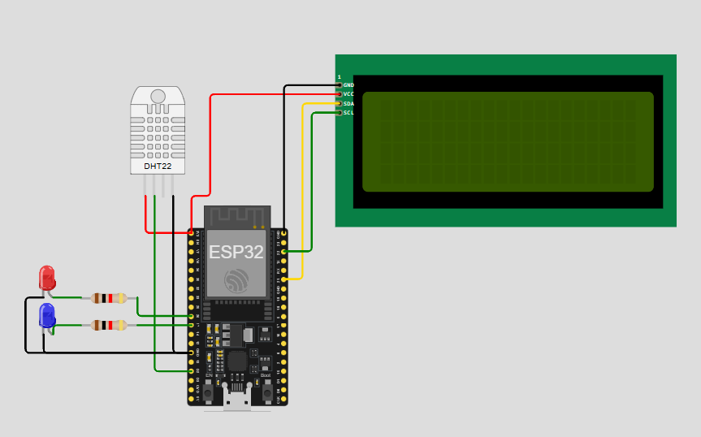
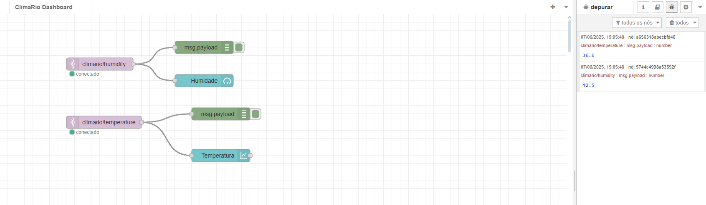
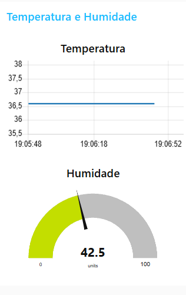

# Zylo- Sistema de Alerta Climático IoT

Sistema embarcado com ESP32, sensores ambientais e comunicação MQTT, integrando um painel Node-RED para visualização de temperatura e umidade em tempo real.

---

## 📅 Requisitos

* ESP32 DevKit
* Sensor DHT22 (Temperatura/Umidade)
* 2 LEDs (vermelho, azul)
* Resistor de 1k para cada LED
* Display LCD 20x4 com módulo I2C

---

## 📒 Bibliotecas Necessárias (Arduino IDE)

1. WiFi
2. PubSubClient
3. DHTesp
4. LiquidCrystal\_I2C

Instale em:

```
Sketch > Include Library > Manage Libraries...
```

---

## 🚀 Execução do Projeto

### 1. ESP32

* Copie o código para o Arduino IDE
* Configure a placa: "ESP32 Dev Module"
* Configure a porta: Tools > Port
* Carregue o sketch
* Abra o Serial Monitor (115200 baud)
* Monte o ESP32 ou copie e cole o diagram.json

### 2. Node-RED


* Inicie o Node-RED: `node-red`
* Acesse: `http://localhost:1880`
* Instale a paleta `node-red-dashboard` via Menu > Manage Palette
* Importe o `flow.json`
* Faça o deploy
* Acesse o dashboard em `http://localhost:1880/ui`

---

## 🔗 Tópicos MQTT Utilizados

| Tópico                 | Descrição              |
| ---------------------- | ---------------------- |
| `climario/temperature` | Temperatura em graus C |
| `climario/humidity`    | Umidade relativa %     |

---

## 📊 Dashboard Node-RED

* **Gráfico de Temperatura:** linha do tempo
* **Gauge de Umidade:** mostrador de ponteiro
* **Status dos LEDs:** automático via ESP32
* **LCD:** exibe os dados no dispositivo

---

## 💡 Observações

* As leituras são feitas a cada 2 segundos
* Temperaturas acima de 30ºC acendem o LED vermelho
* Umidades abaixo de 40% acendem o LED azul

---

> Repositório criado para atender aos requisitos mínimos do projeto IoT com ESP32 + Node-RED + MQTT + Dashboard.

---

## 🎓 Autores

João Pedro Cancian Corrêa – RM: 555341
Giulia Camillo - RM: 554473
Caroline de Oliveira - RM: 559123

Desenvolvido como parte da Sprint 1 - 3º Semestre
